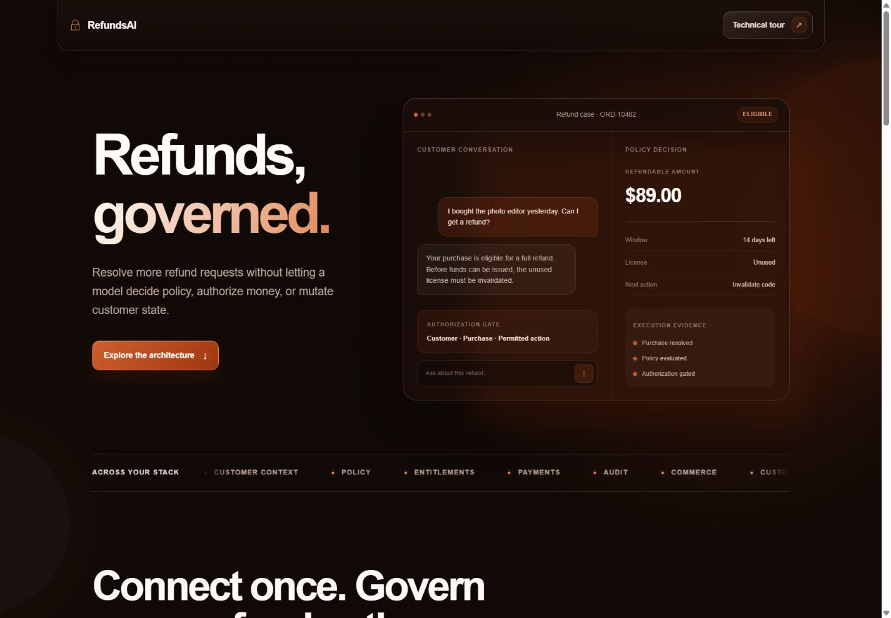
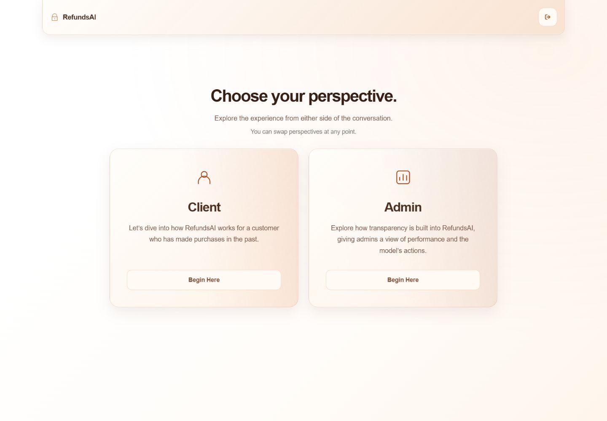
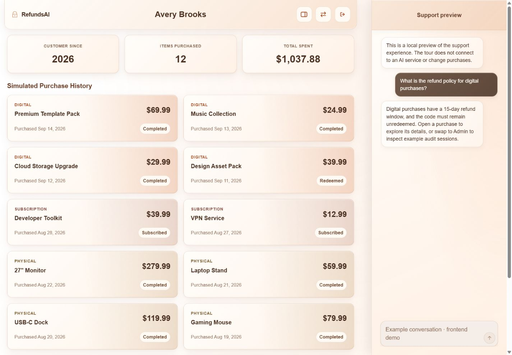
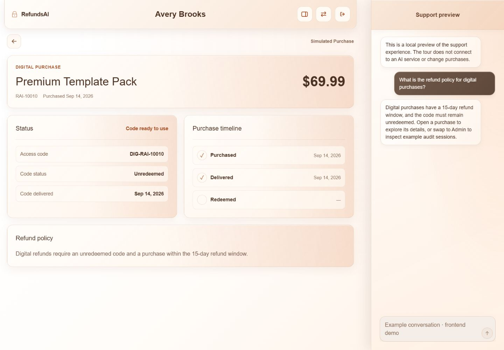
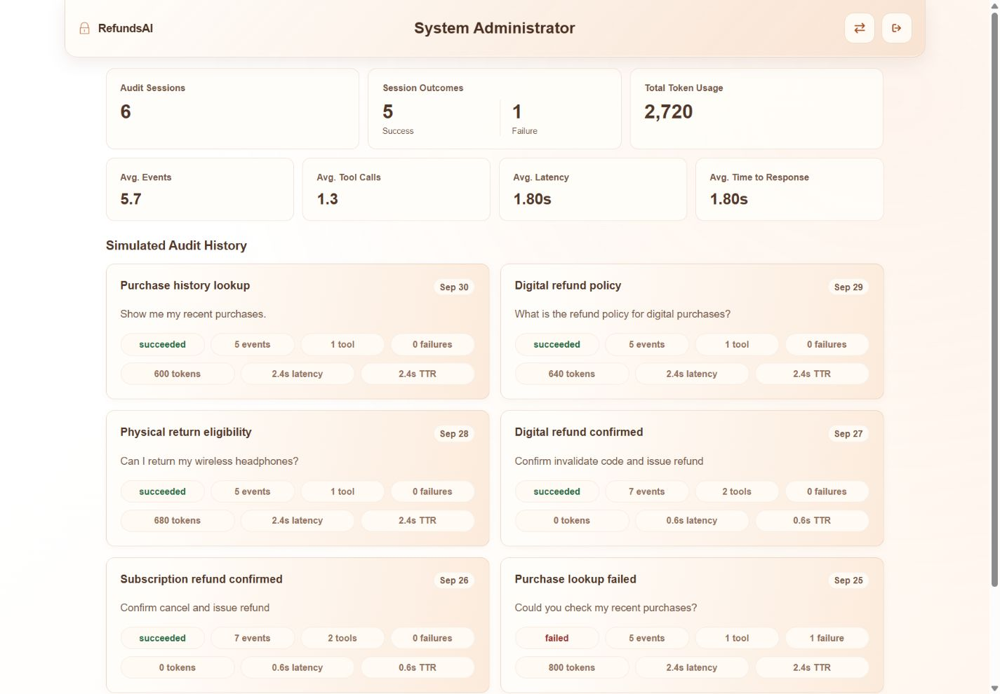
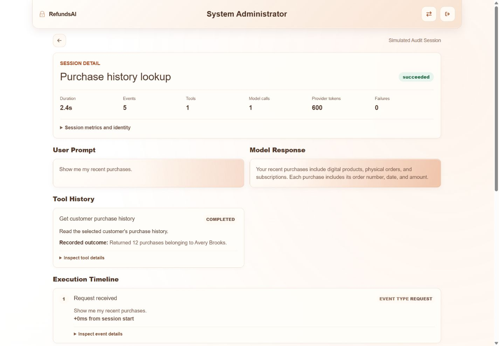
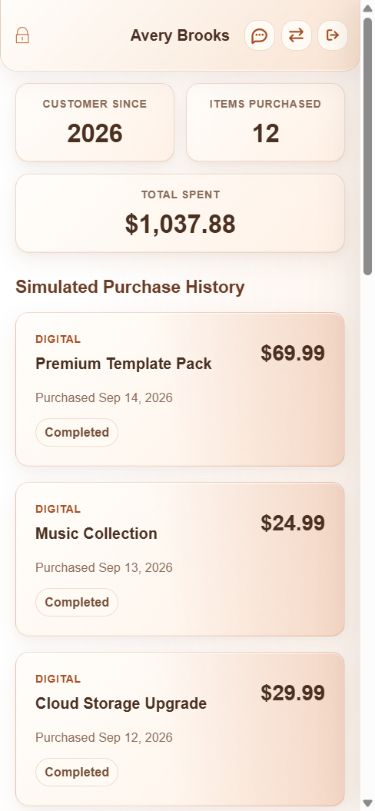

# RefundsAI

> AI-assisted refunds. Backend-owned policy. Visible execution.

[Explore the product concept](https://refundsai.dontaiwilson.com) · [Dontai Wilson's portfolio](https://dontaiwilson.com)

[Explore the product concept](https://refundsai.dontaiwilson.com) · [Dontai Wilson's portfolio](https://dontaiwilson.com)

Built as a seven-day technical delivery, RefundsAI combines conversational support
with deterministic policy, explicit consent, guarded execution, and auditability.

The service architecture is the core product. The screens below illustrate how it
could be integrated into customer support and operational review.

## Integration Examples

Customer and administrator surfaces give the same infrastructure two perspectives:
support in purchase context, and visibility into how each request was handled.

### Landing page

The product introduction establishes the central rule: the model interprets and explains;
backend services decide what is allowed.



### Customer and administrator perspectives

Customer-facing support and administrative inspection can be presented through
separate interfaces backed by the same workflow.



### Client: purchase history and support

The support panel sits beside purchase history, illustrating an integration within an
existing customer portal. Purchase context stays visible throughout the conversation.



### Client: purchase details

Status, lifecycle events, and refund policy provide the facts the support workflow needs.
Digital, physical, and subscription purchases each have their own requirements.



### Admin: performance overview

An operator dashboard can summarize successes, failures, token usage, and average
events, tool calls, latency, and time to response.



### Admin: execution evidence

Session evidence connects each request to its response, tool outcomes, and ordered
events, with deeper inspection of identity, token breakdowns, and payloads.



<details>
<summary>Additional support and mobile views</summary>


The client experience adapts to mobile, with full-screen support when opened.



</details>

## Seven-Day Core Delivery

The backend implementation supplies the workflow illustrated above.

| Capability | Responsibility |
| --- | --- |
| Language and context | Resolve intent, purchase references, and active workflow scope. |
| Grounded tools | Read purchase facts, policy, and evaluated eligibility. |
| Policy enforcement | Determine eligibility from persisted facts. |
| Confirmation gates | Validate exact, scoped, once-consumable consent. |
| Guarded execution | Apply permitted lifecycle transitions and verify persistence. |
| Auditability | Record model, tool, validation, and mutation evidence. |

Exact confirmation turns can execute entirely in the backend, without another model call.
Real authentication, payment processing, and production hardening are outside this scope.

## Architecture

The API separates the presentation surface from the core workflow.
Next.js is one example integration; another customer-facing interface can use the same boundary.

```text
Customer interface / Admin interface
                 |
          FastAPI + LangGraph
             /         \
      Model             Deterministic services
      Interpret         Policy + consent
      Request reads     Guarded execution
      Explain           Verify outcomes
             \         /
          Supabase PostgreSQL
```

| Layer | Owns |
| --- | --- |
| Frontend | Customer context, interaction, and presentation. |
| Model | Language interpretation, read-tool requests, and grounded explanations. |
| Backend | Policy decisions, consent validation, and refund execution. |
| Database | Authoritative facts, lifecycle state, and ordered audit records. |

Refund state lives with its product type: `digital_purchase_details`,
`physical_purchase_details`, or `subscription_purchase_details`.
The shared `purchases` table holds order and final refund summary facts.

## Explore the Implementation

| Reference | What to inspect |
| --- | --- |
| [Architecture](.ai-context/01-architecture.md) | Service layers and request flow. |
| [Responsibility boundaries](.ai-context/02-boundaries.md) | Where model capabilities end and backend authority begins. |
| [Refund policy](docs/REFUND_POLICY.md) | Product-specific rules and lifecycle requirements. |
| [Engineering insights](docs/DEVELOPER_INSIGHTS.md) | Implementation decisions and tradeoffs. |
| [API contracts](.ai-context/09-api.md) | Integration points for customer and operator interfaces. |

## Technology Stack

| Surface | Technology |
| --- | --- |
| Frontend | Next.js, React, TypeScript, Tailwind CSS, Framer Motion |
| API and orchestration | FastAPI, Python, Pydantic, LangGraph, OpenAI |
| Persistence | Supabase PostgreSQL, psycopg, PL/pgSQL |
| Validation | Vitest, ESLint, pytest, pytest-cov, Ruff |
| Development | npm workspaces, Docker Compose, Git |

---

## Core Service Development

The service implementation lives in `apps/api`. The following setup runs the API,
configures its database and model dependencies, and validates the core workflow.

### Backend

The backend uses FastAPI with pinned pip requirements.

Create the virtual environment from the repository root:

```bash
python --version
python -m venv apps/api/.venv
cd apps/api
```

Activate the virtual environment for your shell:

```powershell
# PowerShell
.\.venv\Scripts\Activate.ps1
```

```cmd
:: Command Prompt
.venv\Scripts\activate.bat
```

```bash
# Git Bash / WSL / macOS / Linux
source .venv/bin/activate
```

Install backend dependencies:

```bash
python -m pip install -r requirements-dev.txt
```

Run the API:

```bash
python -m uvicorn refunds_ai_api.main:app --app-dir src --reload
```

Lint:

```bash
python -m ruff check src tests
```

Test:

```bash
python -m pytest tests
```

Coverage:

```bash
python -m pytest tests --cov=refunds_ai_api --cov-report=term-missing --cov-fail-under=90
```

Build check:

```bash
python -m compileall src tests
```

Backend direct dependencies are pinned in `apps/api/requirements.txt` and `apps/api/requirements-dev.txt`. The resolved validation baseline is recorded in `apps/api/requirements.lock`.

The local API server runs on `http://localhost:8000`.

Uvicorn logs may show `http://0.0.0.0:8000` from inside Docker. Use `http://localhost:8000` from the host machine.

### Backend Container

```bash
docker compose up api --build
```

The container exposes the backend on `http://localhost:8000`.

FastAPI docs are available at `http://localhost:8000/docs`.

### Supabase Database

Create a Supabase project, then copy the PostgreSQL connection string from Project Settings > Database.

For local API development, you can configure `SUPABASE_DB_URL` in the repository root `.env` file (the application automatically searches parent directories up to `../../.env` as a fallback) or create `apps/api/.env` locally:

```bash
cd apps/api
cp .env.example .env
```

Set `SUPABASE_DB_URL` to the Supabase PostgreSQL connection string.

For Docker Compose, create a root `.env` from the tracked example:

```bash
cp .env.example .env
```

Docker Compose passes `SUPABASE_DB_URL` and `DATABASE_CONNECT_TIMEOUT_SECONDS` into the API container.

Check database connectivity:

```bash
curl http://localhost:8000/health/database
```

The database health check endpoint returns HTTP `200 OK` on success, or `503 Service Unavailable` when database configuration is missing or connectivity checks fail. It validates connectivity only; use the migration commands for schema readiness.

Apply migrations and seed demo data from `apps/api`:

```bash
$env:PYTHONPATH = "src"; python -m refunds_ai_api.database.migrator apply
$env:PYTHONPATH = "src"; python -m refunds_ai_api.database.migrator seed
```

For a destructive clean demo reset, apply migrations and reseed from today's UTC date:

```bash
$env:REFUNDSAI_ALLOW_DEMO_DB_RESET = "true"
$env:PYTHONPATH = "src"; python -m refunds_ai_api.database.migrator reset-demo
```

`reset-demo` clears seeded users, roles, products, purchases, purchase details, audit sessions, and audit events before reseeding. It is development/demo-only and is blocked unless the explicit reset flag is set.

### AI Chat Configuration

The AI chat flow uses OpenAI and LangGraph for purchase intelligence, policy lookup, backend-evaluated refund eligibility, and confirmation-gated refund workflow actions.

Set the backend AI environment variables in `apps/api/.env` for local API development, or in the repository root `.env` for Docker Compose:

```bash
OPENAI_API_KEY=sk-...
OPENAI_MODEL=gpt-5.4-mini
```

Check model connectivity:

```bash
curl http://localhost:8000/health/model
```

### AI Chat Orchestration Details

The customer support panel communicates with the backend via `POST /api/chat`. The orchestration logic operates through several distinct phases:

#### 1. Context & Pronoun Resolution
To resolve references like *"those purchases"* or *"this item"* without replaying the full chat transcript, requests carry a compact `conversation_state` and `page_context`:
* **Page Grounding**: Resolves the customer's active purchase-detail page ID or category view.
* **Context Resolution Priority**: Matches references against (1) page context, (2) active refund workflow state, (3) explicit product/SKU/order names, (4) active result sets, and (5) global history.
* **Result Set Scopes**: Stores a `scope_label` (e.g., list/aggregate results) so that ordinal descriptors (*"last one"*, *"oldest"*, *"cheapest"*) evaluate within the active query results.

#### 2. Read-Only Backend Tools
The LangGraph workflow resolves and executes deterministic tools on behalf of the customer:
* `validate_customer_account`: Read the active mock customer.
* `get_customer_purchase_history`: Fetch all customer purchases.
* `get_purchase_history_by_date_range`: Search purchases within a date window.
* `get_purchase_count_by_amount_threshold`: Count purchases above/below a price.
* `get_refund_policy`: Retrieve deterministic policy rules.
* `get_refund_eligibility`: Evaluate backend-computed eligibility facts.

#### 3. Confirmation-Gated Mutations
The model never holds the consent authority to mutate database state. Mutations are protected by exact matching commands:
* **Digital Purchase**: Requires `Confirm invalidate code and issue refund`
* **Subscription Purchase**: Requires `Confirm cancel and issue refund`
* **Physical Purchase**: Requires `Confirm start return and issue label`

* **Safety Guards**: Ambiguous confirmations (*"yes"*, *"do it"*, *"proceed"*) are rejected at the mutation boundary; only the exact canonical command grants authorization.
* **Atomic Transitions**: Digital and subscription validations may trigger preparation and issuance back-to-back, but the backend processes them as distinct database transactions. Physical workflows halt at return preparation until carrier acceptance is logged.
* **Selective Model Use**: Canonical confirmation turns can execute and respond deterministically with zero model calls.

---

## Repository Structure

```text
.
|-- .ai-context/
|-- apps/
|   |-- api/
|   `-- web/
|-- docs/
|-- AGENTS.md
|-- docker-compose.yml
`-- README.md
```

---

## Project Context

RefundsAI follows a documentation-first development workflow.

The `.ai-context/` directory contains the authoritative project documentation, including:

* Project vision
* Architecture
* System boundaries
* Business logic
* Engineering standards
* Testing expectations
* API contracts
* Database design
* Tool specifications
* Security boundaries

Both human contributors and AI engineering agents should reference this documentation before making implementation decisions.

Supporting project documents:

* [`docs/REFUND_POLICY.md`](docs/REFUND_POLICY.md)
* [`docs/DEVELOPER_INSIGHTS.md`](docs/DEVELOPER_INSIGHTS.md)
* [`docs/ROADMAP.md`](docs/ROADMAP.md)

---

## License

This repository is provided as part of a technical demonstration and portfolio project.

RefundsAI is source-available for technical evaluation and reference only. The
code is not open source and may not be used, copied, modified, redistributed,
hosted, or commercialized without prior written permission.

See [`LICENSE`](LICENSE) for the full terms.
